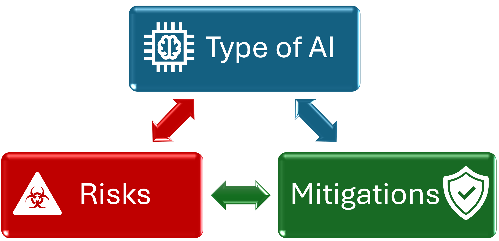
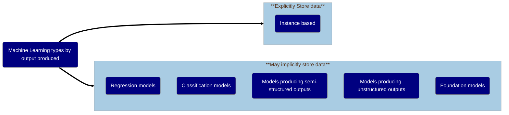
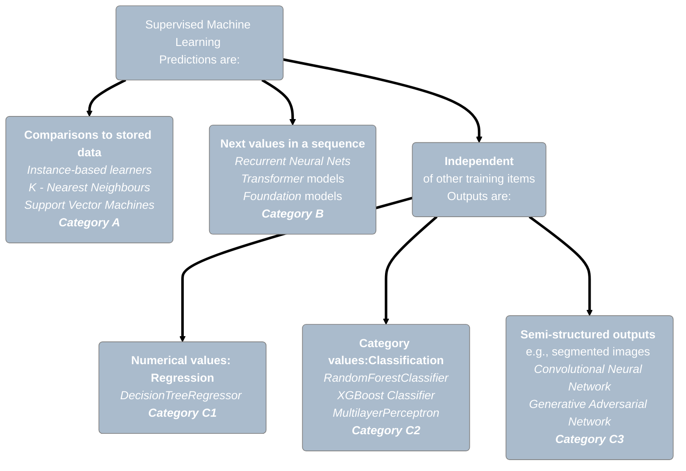

# Types of risks and possible mitigations associated with different categories of machine learning models

> ## [!IMPORTANT] NOTE
> ## This document has been moved, please find the [latest under-development version here.](https://docs.google.com/document/d/1-BqycnAmIO7qwKRwClpBNWDJ4I7u0aDa389_W2JY7cw/edit?tab=t.0#heading=h.lqj7sw5dp6de)

<h3>Initial Authors: Jim Smith, Alba Crespi Boixader</h3>

 V0.3 September 2025

# Table of contents
1. [Introduction](#introduction)
    1. [Summary Table](#summary-table) 
2. [Purpose](#purpose)
    1. [How to navigate and use this document](#howtouse)
    2. [Assumptions](#assumptions)
3. [Types of Risk Considered](#types-of-risk)
   1. [Extraction of explicitly stored data](#explicit)
   2. [Small group reporting](#small-group)
   3. [Class Disclosure](#class-disclosure)
   4. [Low Residual Degrees of Freedom](#DoF)
   5. [Membership inference](#mia)
   6. [Attribute Inference](#aia)
   7. [Model Inversion](#model-inversion)
   8. [Jailbreaking](#regurgitation) 
4. [Categories of models according to type of prediction](#categories)
   1. [Category A: Predictions based om comparisons to stored data](#instance)
   2. [Category B. Models trained on sequence-based tasks](#sequence)
   3. [Category C: Predictions for each input made independently](#independent)
      1. [Regression models](#regression)
      2. [Classification Models](#classification)
      3. [Models producing semi-structured outputs](#semi-structured)

---

# 1: Introduction 

Trusted Research Environments (TREs) are experiencing an increased demand for projects using AI and ML, and then wishing to export models trained on sensitive data.  
There is a need to clearly identify which data privacy risks TREs would face, and these will depend on the type of technique the user or researcher employs.  
Risks can be minimised and avoided in most cases, but cannot always be completely eliminated.

Prevent Privacy Leakage</img>

<!--   -->

*Electronic health records (eHRs) and other types of personal and sensitive data must be protected and ensure there is no privacy leakage when a Machine learning model is created.*

Previous work on GRAIMatter project[1], SACRO[2] and SDC-Reboot Community Interest Group showed the need for a simple and clear guidance to identify risks associated with ML projects, and the corresponding mitigation strategies.

## Summary of risks for different types of prediction (categories of model) 

|Category|Nature of  prediction    | Extraction of  explicitly  included data | Small group   reporting | Class  disclosure | Low Degrees  of Freedom| Membership  Inference | Attribute   Inference | Model   Inversion | Jail- breaking | Computational  cost|
|---|---|---|---|---|---|---|---|---|---|---|
|A| Comparison to  stored data|🔴|🔴|🔴|🔴|🔴|🔴|🔴|🟢|&#x2191;|
|B|Next token in  sequence  (fine-tuned LLMs etc.)|🟢|🟡|🟡|🔴|🔴|🔴|🔴|🔴|&#x2191;&#x2191;&#x2191;&#x2191;&#x2191;&#x2191;&#x2191;|
|C1|Numbers  (Regression) |🟢|🟡|🟡|🔴|🔴|🔴|🔴|🟢|&#x2191;&#x2191;|
|C2|Class labels (Classifiers)|🟢|🟡|🟡|🔴|🔴|🔴|🔴|🟢|&#x2191;&#x2191;|
|C3|Semi-structured   outputs|🟢|🟢|🟢|🔴|🔴|🟡|🔴|🟡|&#x2191;&#x2191;&#x2191;|

|Legend: |🟢Low risk | 🟡Medium Risk | 🔴High Risk |❓Unknown|
|---|---|---|---|---|

---

# 2: Purpose 

This document aims to capture the types of privacy risks and mitigations associated with different forms of Machine Learning (ML).  
It is a counter-part to the [statbarns taxonomy](https://doi.org/10.1007%2F978-3-031-69651-0_19)[3] for 'traditional analytic outputs from TREs.  
That work consolidated 20+ years of theory by grouping analyses into types (statbarns) according to the nature of their outputs such as *frequencies*, *shapes*, *linear aggregates* etc. 
Each statbarn has an associated set of risk and mitigations.  
>Thus, for example, once you know how to check and mitigate risks for contingency tables (usually via a MinimumThresholdCheck )
>  you can apply that knowledge for everything else in the *frequencies* statbarn.

Here we extend that work to produce a taxonomy of trained ML models, with associated risks and  corresponding mitigation strategies.  
When a TRE is faced with a project proposing to train and egress a ML model, the taxonomy allows them to quickly  identify the type of model:
- reducing the number of options the need to consider (because there are hundreds of algorithms for creating ML models)  
- allowing them to identify appropriate  risks assessments and mitigations
- enhancing consistency between TREs.

*Each type of ML has a set of risks-mitigations associated.*
> [!IMPORTANT]
> *Note that when there is no egress of the model from the TRE, there is no risk of privacy leakage from the model. Therefore this guide does not apply.*

## 2 A: How to navigate and use this document 

Machine learning models are classified according to the outputs produced.   
So when using this guide to evaluate an ML project, 
- researchers need to provide sufficient detail of *how* the ML model is created and *what* it is predicting
- so that  TRE staff to understand which category to look into.  
Therefore the right set of mitigation strategies can be applied where and when needed.

According to our classification, you need to decide which case applies to the specific project to be evaluated. 
To help with this, for each type of model we provide:
- A brief description,
- Examples of specific algorithms that can produce this type of model
- The risks associated with the type of model
- Potential mitigation strategies for each risk identified.

At the end of this document there is a table summary which can be useful to get an overall idea.   
However, the table in isolation might be out of context.   
So it is recommended to always read the relevant text before taking any decision.

## 2 B: Assumptions

1. Data is pseudo-anonymised following current existing processes,  before the TRE users can access the dataset.

2. All the projects and outputs from a project will undergo output check prior to release. This process may vary from TRE to TRE.

3. All the users in a TRE should take mandatory training.

This recommendations in this guide are additional to those normally employed for traditional statistical disclosure control and ordinary mitigation strategies.

> [!NOTE]
> * In the text below we use the terms:
> *  [training data](#training-data) to refer to the subset of the data provided by the TRE which the researcher uses for training, and
> *  [input data](#input-data) to mean the training data **after pre-processing** i.e. in the form presented to the model for training.
> *  These may be the same, or pre-processing may provide the input data with additional anonymity.

** CHECK THE TERMS ARE USED CONSISTENTLY MAYBE DEFINE RAW DATA (from TRE or deployment) AS WELL**

---

# 3: Types of risk considered 

## 3.1 Extraction of *explicitly* stored data: 
  Some models work on the basis of including a carefully selected amount of input data included to be able to make predictions. In fact this is how the so called "Lazy learners" or "instance-based" models work.
  
In this case an external attacker can directly extract some of the training data from the egressed model.  
The only mitigation for this risk is that the TRE would be content to release the training data as provided to the model.
Arguments supporting this will usually rely on the pre-processing applied:
    - it might be so complex that data effectively becomes *k-anonymous*  
    - it might apply a Differentially Private transformation (in which case the $\epsilon\$ parameter needs to be agreed).

---

The next set of risks have direct counterparts in the disclosure control of "traditional" statistical outputs.

## 3.2 Small-group reporting: 
  Some individual's data that belong to a specific group or category, where only a few individuals are present, could be easily identifiable. This can lead to re-identification, specially if some characteristics of the group are already known. For example patients in a specific NHS board that suffer from a rare genetic disease.
## 3.3 Class Disclosure: 
  Class disclosure risk occurs when information of a distinct population group is reveled, often inadvertently. For instance, when either none or all of the observations in a given category come from that subpopulation.
## 3.4 Low Residual Degrees of Freedom: 
If a regression model becomes "saturated" (considers all combinations of variables) it esentially becomes a (complex) look-up function.  The usual test is that the *residual degrees of freedom* (the number of training records minus the number of trainable parameters) is above some threshold (typically 10).

---

The  third set of risks, sometimes referred to in the ML literature *Privacy attacks* or *Reconstruction attacks* recreate one or more record from the data used to train the ML model, either partially or fully.

## 3.5 Membership Inference Attack (MIA): 
The objective of this type of attack is to determine whether a specific record or data belonging to a person was part of the dataset used to train the machine learning.

## 3.6 Attribute Inference Attack (AIA): 
Usually applied to known members,when  some information of a record belonging to a person is known, this attack aims to find out the rest of items of the record. Some information belonging to some people, e.g. famous, can be publicly available.

## 3.7 Model Inversion: 
The goal is to recover a subset or group of records that have something in common (belong a specific sub-class), that is disclosing records belonging to several people at a time. For example, all the people who suffer from a distinct rare disease used in the training data.

## 3.8 Jailbreaking (triggering model to regurgitate *implicitly* stored data) 
Sometimes models can repeat precisely part of the data that they have been trained on, even if it wasn't supposed to copy. This can happen when a model memorised the patterns on the data so well that it can reproduce part of it without explicitly storing it.

---

# 4: Categorisation of models according to training purpose 

<!----
Traditionally ML is classified depending on the type of learning as:
- *supervised learning*: where a model receives feedback on how accurately it predicts the known labels for a set of labelled training examples ,
- unsupervised learning or cluster analysis,
- semi-supervised learning,
- dimensionality reduction,
- reinforcement learning

With the continuous appearance of new methods, such as the foundation models, the classification system is subject to change and discrepancies. For example, many people include *Deep Learning* which may be supervised or unsupervised.
Such categorisations also do not take into account which type of model the method produce, which is key to determine the appropriate Disclosure Control (DC) measures.
---->
A categorisation system capturing the architecture of the models produced specifically designed for disclosure control will allow a static and clear classification system for such purpose. 
Mitigation strategies and guidelines for DC can then be defined for each of the cases.

In this guide we focus on **Supervised Learning**. Given:
- a dataset of training examples with known labels
- a type of model to produce (e.g. neural network, tree-based etc.)
   - with associated *parameters* e.g. weights in a neural networks, 'splitting decisions' in nodes of a tree etc.
- a learning algorithm
  
*Training* consists of iteratively:
1. presenting the data to the model and noting its predictions
2. comparing the predictions with the true values, to create feedback (e.g. a *loss function*)
3. adjusting  the model's parameters in attempt to improve the predictions

We identify different types of model based on what happens in the second step, when data is presented to make a prediction.

The diagram below illustrates this idea, and gives with a few example algorithms for each class

<!---

--->

## 4.1 Category A: Predictions made by comparison to explicitly stored data 
Models in **_Category A_** are **extremely high risk** because by their nature they are vulnerable to [extraction of explicitly stored data](#explicit). 
- This risk applies regardless whether the model is predicting numbers (regression) or class labels (classification).
- The **only mitigation** for this risk is that data preprocessing sufficiently removes any personal identifiers.
   - It could be argued this mitigation effectively means that the TRE would be comfortable with releasing the pre-processed data. 
   - For example, the data might be transformed into a synthetic dataset via a 'Differentially' Private' embedding,
     to a stage such that the TRE would be content to release it.
   - To support this mitigation, extensive details of pre-processing of the input data and/or the processed dataset will be required.
  - However, note that this mitigation does not mitigate against risks such  [Class Disclosure](#class-disclosure), [Small groups](#small-group) and [Attribute Inference](#aia).
     Vulnerabilty to these risks should be checked, but it does not make sense to do so unless the primary mitigation has been authorised. 

This category includes:
 -  *Instance-based* (some refers to them as *lazy learners*)  
   This type of algorithm is simple, easy to implement, and still widely used in practice.  
   Predictions for a new record exploit proximity to a subset of data explicitly stored or embedded within the model during training.  
    - The most well-known example is 1-Nearest Neighbor, which essentially asks:   *“What’s label on the closest thing I’ve seen before?”*.
    - Other examples (and their common acronyms) include: k-Nearest Neighbours (KNN); Case-based reasoning (CBR); Self Organising Maps (SOM); Learning Vector       Quantization (LVQ) and Locally Weighted Learning (LWL).

 -  *Kernel Models*  transform input records into a space defined by stored 'kernels', where the prediction task is easier.  
   These kernels are usually usual defined via stored members of the training set.
    - Examples include: Radial Basis Function Networks (RBFN) and Support Vector Machines  such as Support Vector Classifiers and  Support Vector Regressors.

<!--
> [!TIP]
> *Check the model file size. Models that contain data are often large or very large.*

> [!NOTE]
> *It is important to note that almost all Machine Learning Algorithms can be trained to create classification or regression models.*

> [!NOTE]
> *Deep Learning models are typically needed for models that produce semi-structured, unstructured outputs as well as models which are based on pre-processed embedding input data.* 

> [!NOTE]
> Foundation Models are typically designed so that they can subsequently be rapidly repurposed for a range of related classification or regression tasks.
> It is helpful to think of them as a *body* - which learns to perform domain specific preprocessing, and a *head* which makes final predictions for a given task.
> During *pre-training*  the head is typically a sequence-based "predict the masked token" so that they can be trained on unlabelled data.
> Then during *adaptation* the pre-training head is replaced with one designed for a specific task.
> > Therefore it is important for TRE and researcher distinguish between three cases:
> - pre-training a Foundation model *de novo* on TRE data, where all the parameters will be tuned  and may be memorised. This is a Category B application
> - ingressing a pre-trained Foundation model, adding a new head for a specific task, but allowing the learning algorithm to change all of the parameters during adaptation. This is also effectively a category B problem.
> - ingressing a pre-trained Foundatiom model, adding a new head, but then 'freezing' the body and only changing the parameters of the new head during adaptation.  In this case only the new head needs to be exported and risk assessed. This is a category C problem 

-->

## 4.2 Category B. Models trained on sequence-based tasks 
Models in **_Category B_** are also considered high risk as they frequently *implicitly* contain embedded data, that can be hard to test for.  
This is because they typically:
- Have millions (or trillions) of trainable parameters - so have the capacity to simply memorize, rather than generalise from, "unusual" training data
- Use complex architectures that can represent, and be triggered by, certain sequences of events
- Are trained on sequences of tokens, which could be, for example,  words, patches of images, parts of a video, or genotype base-pairs.  
  This means that the potential output space suffers from *Combinatorial explosion*, so models are typically *sparse*.

 This category includes most *Generative AI*. You might also see names like  *Foundation Models*, *Large Language Models* and *Vision-Based Transformers*.   
You may also see these associated with terms such as *encoder-decoder*  and *Transformers*.   
Less frequently nowadays, you might also see names like *Recurrent Neural Network* and *LSTM* network.

*Foundation models* are typically 'pre-trained' using a decoder that attempts to solve a task that does not require manually labelled data, and so can use huge datasets from the internet e.g.:

- predict the next token in a sequence for *large language models* (such as  Open's GPT-series, OpenLLaMa,  BERT, Medi-Bert etc.)
- removing randomly added 'noise' from an image   for *vision-based transformers* (Dall-E, CLIP, RetFound etc )
 
The goal of pre-training is learn a useful 'embedding' (effectively a preprocessing that maps high-dimensional data onto a smaller set of features) that captures all of the important information within a sequence. This embedding forms the bridge between the *encoder* (learned preprocessing) and the *decoder* which transforms the encoded inputs back into a form suitable for a task.  
- After pre-training, they are fine-tuned, adapted, or engineered for specific applications. Their adaptability makes them, in many cases, more efficient and versatile than building separate models for individual tasks.  
  This process of adapting the model for a specific tasks typically uses smaller amounts of labelled data. Often this is done by only removing the 'head" (the final layer(s) of the *decoder*)  and replacing it with one suited to the new task (e.g. *N* output nodes for a classification problem with *N* different labels)

- With just a few powerful foundation models, trained on a limited number of datasets, a wide range of applications becomes possible. However, this also introduces concentration of power, raising concerns about monopolistic control over foundational AI infrastructure.   
  Application specific fine-tuned models are mostly in the field of natural language processing (NLP), and well known examples include:
ChatGPT, DeepSeek, Gemini, and Grok.

**Considerations at project inception**
When a project wants to use a foundation model it is vital from project inception to  be clear whether researchers want to:

- Scenario 1. Import a pre-trained model, then put a new 'head' on it and train that for a new project **without changing the rest of the foundation model**.
  - In this case they may not even need to export most of the model- just the prediction head. Therefore the 'head' can be treated as a simple [regression](#group-b1-regression-models) or [classification](#group-b2-classification-models) model.
  - It would be reasonable to ask the researcher to separate their code into callable functions that do preprocessing (i.e. the unchanged 'body' of the foundation model) and prediction ('head'). This would allow  the TRE can run the various mitigation tests described above.
  - If the head is simply a single output layer, then this is effectively  a linear or logistic regression model and can be evaluated as such.
- Scenario 2. Import a pre-trained model, put a new head on it, then adapt the head **and the 'body' of foundation model weights**.
  - In this case potentially both the head and the body could be memorising trainign data and so need assessing
- Scenario 3. Train a foundation model from scratch and then export it.

**Risks and mitigations**

Often, it is unclear the data which the foundation model had been pre-trained on. Including, dataset bias, copyright and license. TREs must ensure it can be hosted. Note that, as they are based on deep neural networks is highly likely it may contain data inside the pre-trained model.

In both these last two cases the full model needs to be evaluated for risks including [Small Group Reporting](#small-group), [Class Disclosure](#class-disclosure), [Attribute Inference](#aia) and [Membership Inference](#mia).
- The first three risks  can be usually be measured without retraining the model, which may be plausible.
- However, current tests to assess the risk of Membership Inference involve training several 'shadow' models.
   These have the same complexity as the original model but use with slightly different datasets.  
   Whether training multiple shadow models will depend entirely on the run-time it took to train the researcher's original model:
    - it  **may** be possible for scenario 2, depending on the size of the training data and however many `epochs' (iterations) of training were used.
    - is **highly unlikely** to be feasible for scenario 3 (training a foundation model from scratch).

<b>Note that</b> a recent <a href="https://grants.nih.gov/grants/guide/notice-files/NOT-OD-25-081.html">US NIH Directive</a>] states that  Generative AI trained of fine-tuned on confidential data should be treated as data derivatives and not released.   

Therefore in scenarios 2 and 3 we would currently only recommend mitigation  via ‘model query controls’ (i.e. not releasing)

## 4.3 Category C: Predictions for each input made independently 

This category are lower privacy risk type of ML models. Data is not explicitly stored, however, in some circumstances might leak certain specific groups of data.
Models in **_Category C_** where models may not embed data,  are grouped depending on the type of privacy risk they pose at the output check time. The key question is whether models are designed to predict:

- *Numerical values:* when the model predict measurable numbers in real-world quantities, such as height, weight or temperature (regression models)
- *Class probabilities:* these are numbers between 0 and 1 (or 0% to 100%) representing how confident the model is that something belongs to a specific category. For example, '70% cat, 30% dog'. (classification)
- *Semi-structured outputs:* those predictions are more flexible than the previous type, it's organised but not fixed. It can be a combination of labels, text, lists, etc. (e.g. segmented images)

<!--## $${\text{\color{blue}Group\ 2:\ Regression\ Models}}$$-->
### Group C.1. Regression models 

Regression models are designed to predict a number out of range (continuous variable), which is based on the data provided to train the model. Instead of saying how likely something is, they predict how much or how long.
Examples from different domains include: estimating air pollutant levels, predict risk of re-offending, forecasting duration of hospital stay, analysing drug response in patients, etc.

In general, the risks and mitigations associated with regression models are similar to those found in linear,logistic, or logit Regression, which are well-established in both research and applied settings.

This categories includes:

- Simple and multiple linear regression models, which are the most well-known ML technique.
- Polynomial regression for when the relationship between variables is not linear.
- LASSO(least absolute shrinkage and selection operator) and ridge regression which are commonly applied when the dataset contains large number of features.
- the *ARIMA* family of models
- variants of tree/forest based ML algorithms such  as *DecisionTreeRegressor*, *RandonForestRegressor*, *XGBoostRegressor*
- artificial neural networks such as scikit-learn's *MLPRegressor* and models built using frameworks such  *pytorch* or *keras/tensorflow* that use a linear activation function in the final layer.

**Risks and Mitigations**
The principal risk is that  the model should not be specified so completely that  any part of it describes a small group of records.
This typically manifests as [Low Residual Degress of Freedom](#DoF).

Some models may implicitly or explicitly perform *piece-wise regression* in  which case each sub-group should be checked for size.

- i.e., are there some output values which are only predicted for a small number of training records?

There may also be a risk of [Class Disclosure](#class-disclosure), but this probably only occurs when a models is trained to predict levels of more 2 or more variables.

Mitigations might be that:  

1. Models pass  'Structural Attacks'

- for classification models these  check for residual degrees of freedom, class disclosure and k-anonymity
- a  small amount of work is needed  to adapt to regression models.
- prioritisation to be decided by the community
- These are relatively cheap to run as they do not involve training any new models.

2. Model Query Controls

- might be appropriate for extremely large regression models with multiple predicted variables

<!--

--->

<!--## $${\text{\color{blue}Group\ 3:\ Classification\ Models}}$$-->

### Group C.2. Classification Models.

These models are designed to assign a new given entry or data point to a one of the predefined set of categories, which can contain 2 or more options. 

Unlike the regression models, which predict a number out of a continuous range, classification is categorical, meaning that there is a choices of specified items. It enables informed decision-making. For example, it can be used as spam filter, or to predict if a given image contain similar types of vehicles like a car, a van, a bicycle, a motorbike, a lorry etc and it shows for each type of vehicle. It can also be used to predict election voting or linking genetic/health records to different disease diagnoses. The output of these models often have a probability associated for each item, for instance a model that can predict the probability (or risk) that a patient may suffer from cancer.

> [!IMPORTANT]
> *Note that in traditional type of ML classification methods include KNN or SVMs, however, since these methods embed data, for the purpose of disclosure control such methods are excluded from this category.*

This category includes simple statistical approaches such as *logistic regression*, but in fact classification models can be created with most supervised Machine Learning Algorithms.

**Risks  and Mitigations**
Because many classification models form a partition of the input space and then report class probabilities within those partitions, they are little different from human-designed partitions such as tables. Therefore risks including [Small-group reporting](#small-group) ( which can enable Re-identification / Attribute Inference), and  [Class Disclosure](#class-disclosure) apply. These can be assessed, and mitigated for by passing checks such as `sacroml.attack.StructuralAttack()`. 

However, whereas humans typically use common groupings to partition the data (for example dividing the integer *age* variable into categories such as *10-19*, *20-29*. ...) ML algorithms are driven by data, and hence the placement of partitions will often reflect values within individual records. Hence classification models, however simple,  may be vulnerable to risks such as [Membership Inference](#mia), [Attribute Inference for known members](#aia) and [Model Inversion](#model-inversion)

This is an active research area. Currently the best method for risk-assessment is to use a tool such  as [sacroml](https://github.com/aisdc/sacroml) to run a series of "worst-case case scenario" attacks to estimate an upper-bound on vulnerability.

### Group C.3. Models producing semi-structured outputs

These ML models generate outputs that are somewhat organised, but not as rigid as structured data like tables, yet more organised than free-form text. They produce a multi-field response.The output is generally flexible format like lists, or pairs of key-values, JSON, decision trees, ranked lists, sequence of labels and probability distributions. The main advantage is their adaptability. It is often used on data that doesn't have group labels (e.g. patients vs. controls, or dogs vs. cats). Instead, the algorithm identifies groups based on similarity measures.

For example labelling specific areas of an image, telling us what is where, or extracting facts such as names and dates from documents. And it is machine readable. They have the potential to reveal hidden patterns, novel structures or new relationships. Human bias can be reduced and grouping is based on data structure rather than assumed or predefined categories.

This type of models may be used as input for other type of more structured ML, for example descriptors of segmented "regions of interest" may be used in vision-based quality control, medical diagnosis, etc.  

This category includes Convolutional Neural Network models such as U-Net etc.

  
**Risks  and Mitigations**
The risks derive form the fact that regions of interest may relate only to one record, or records from a group of people. Therefore there is a risk that the learned "feature detectors"  may in fact be memorising aspects of records.

Hence potential risks include  [Small-group reporting](#small-group), [Class Disclosure](#class-disclosure), [Membership Inference](#mia), [Attribute Inference for known members](#aia) and [Model Inversion](#model-inversion).

For most of these the best mitigation is to run and report attacks that attempt  replicate what an adversary might do.

---

<!--

-->

<!--## $${\text{\color{blue}Group5:\ Models\ producing\ unstructured\ outputs (e.g.\ Natural\ Language).}}$$-->

<!---

### Group C.4. Models producing unstructured outputs

This type refers to the models that generate outputs that have no predefined structure. The information is not categorised, generally requires of interpretation and is not machine readable. It includes generative AI like Variational Autoencoders (VAEs), Generative Adversarial Networks (GANs), Diffusion Models and Transformers.

The output is produced from patterns learned from the data during the training phase. In some cases the output produced may be repetitive or limited variations, especially when the original data is not diverse enough. Examples of outputs include answers to questions, generate free text, images, videos and music.

#### Examples

- Models that  produce summaries of inputs (could be text or images)
- Chatbots
- **Foresight**
- Creation of music
- Generation of images
- Synthetic data generation
- Generation of code and algorithms
- Generate 3D molecular structure

#### Risks  and Mitigations

1. Model can be triggered to regurgitate implictly stored training data
2. Small-group reporting ( which can enable Re-identification / Attribute Inference)
3. Class Disclosure
4. Membership Inference
5. Attribute Inference for known members
6. Model Inversion

Mitigation 1:  *alignment* via human-in-the-loop-reinforcement-learning,

- used for commercial Large Language Models to try and prevent them giving certain responses
- but recent reports suggest that [these defences can be broken](https://www.theguardian.com/tech|nology/2024/apr/03/many-shot-jailbreaking-ai-artificial-intelligence-safety-features-bypass?CMP=Share_iOSApp_Other)

--->

--- 

# References

- Schneider, J., Meske, C. & Kuss, P. Foundation Models. Bus Inf Syst Eng 66, 221–231 (2024). <https://doi.org/10.1007/s12599-024-00851-0>
- K. Sun, A. Roy, and J. M. Tobin, “Artificial intelligence and machine learning: Definition of terms and current concepts in critical care research,” J. Crit. Care, vol. 82, no. July 2023, p. 154792, 2024. <https://www.sciencedirect.com/science/article/pii/S088394412400279X>
- A. Bandi, P. V. S. R. Adapa, and Y. E. V. P. K. Kuchi, “The Power of Generative AI: A Review of Requirements, Models, Input–Output Formats, Evaluation Metrics, and Challenges,” Futur. Internet, vol. 15, no. 8, 2023. <https://www.mdpi.com/1999-5903/15/8/260>

<https://dl.acm.org/doi/full/10.1145/3624010>

- Wui, H, and Yao, C.:*Membership Inference Attacks on Large-Scale Models: A Survey* arXiv preprint. <https://doi.org/10.48550/arXiv.2503.19338>

[1] Learning (ML) models from Trusted Research Environments (TREs),” Zenodo, 2022.

[2] P. W. J.E. Smith, M. Albashir, S. Bacon, B. Butler-Cole, J. Caldwell, C. Cole, A. Crespi Boixader, E. Green, E. Jefferson, Y. Jones, S. Krueger, J. Liley, A. McNeill, K. O’Sullivan, K. Oldfield, R. Preen, F. Ritchie, L. Robinson, S. Rogers, P. Stokes, A. Tilbr, “Semi-Automated Checking of Research Outputs (SACRO),” Zenodo, 2023.

[3] E. Green, F. Ritchie, and P. White, “The statbarn: A New Model for Output Statistical Disclosure Control,” in Privacy in Statistical Databases, 2024, pp. 284–293.

***NEED FIXING***

# Summary tables

## TO-DO: refactor table below into mitigations per risk

| Nature of  prediction | Type of model | Risk | Event likelihood |  Mitigation | Stage | Residual risks | Adversarial attacks required | Computational cost |
| --- |  --- | --- | --- | --- | --- | --- |--- | --- |
| A: Comparison to  stored data|  Instance-based Support Vector Machines | [Extraction of explicitly stored data](#explicit) |🔴| TRE would be prepared to release input data   **or** Deploy to MQC system | - Design  - Governance  - Development  - Release| - Small group reporting 🔴   - Class disclosure 🔴   - Attribute Inference| Required when mitigations in place |  &#x2191; |
| B: Token in   sequence | Generative AI  Foundation models |  Small group reporting   Class Disclosure   Membership Inference    Attribute Inference   Jailbreaking |🔴   🟡  🟡  🟢 🔴|- Do not release of the TRE   - Only adapt and egress new 'head' for imported pre-trained model   Adapt head **and body** of imported pre-trained model.  Train a foundation model from scratch.| - Design  - Development | Unknown | Probably not feasible  due to the size and complexity.  | &#x2191;&#x2191;&#x2191;&#x2191;&#x2191;&#x2191;&#x2191;|
| C: Independent | C.1. Regression models | - Small group reporting   - Class disclosure  |🟢 🟢| - Lower limit on the degrees of freedom   - Perform structural attacks   - Model Query Controls| - Development   - Release |  | Required always 🟢| &#x2191;&#x2191;|
| C: Independent  | C.2. Classification models | - Small group reporting    - Class Disclosure    | 🟢 🟢| |  |  | Required always 🟢| &#x2191;&#x2191;|
| C: Independent  | C.3. Models producing   semi-structured outputs |  - Small group reporting    - Class Disclosure  | 🟢 🟢 ||  |  | Required always 🟢| &#x2191;&#x2191;&#x2191;&#x2191;|

<!---
**Legend**

*Event likelihood* 
🟢 Low or very low 
🟡 Medium 
🔴 High 

--->

<!---
Risk classification:

- How likely is the event/specific type of risk to happen.
- The impact it has. For example, for disclosure control could be something such as exposing 1 or 2 records versus exposing all/almost all records.
--->

<!--actors: data controller, model development team, model owner, product users-->

<!---

| Stage | Mitigation | Risk | Groups of model| Responsibilities |
| --- | --- | --- | --- | --- |
| Design  | - Dataset big enough  - Engage with data expert  |   |   | - Data controller  - Model development team  |
| Governance  | - License of model  |   |   |   |
| Pre-project/data | - Training  |   |   |   |
| Development  | - Test data must not be seen by the model at any point.   - Select carefully hyperparameters  - Check size of groups  |   |   |  - Model development team   |
| Evaluation  | - Modify hyperparameters  - Choose appropriate metrics  |   |   | - Develoopment team |
| Disclosure control  |  - Attack simulation  - |   |   | - Data controller |
| Release  |  - MQC system  - User and result register |   |   | - Model owner |

--->

