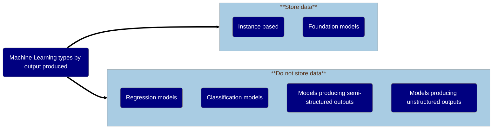

# Documentation of the types of risk and possible mitigations associated with different types of machine learning models

> ℹ️ 
> $$\textcolor{gray}{Initial\ Authors: Jim\ Smith,\ Alba\ Crespi\ Boixader\ 2025}$$
>
> ### $$\textcolor{gray}{V0.2: May\ 2025}$$

<!--<div style="height:10px;background:black;width:400"></div>-->

## Introduction

Trusted Research Environments (TREs) are experiencing an increased demand on project using AI and ML. There is a need to clearly identify which risks, in terms of data privacy, TREs would face depending on the type of technique the user or researcher employs. Risks can be minimised and avoided in most cases, although cannot always be completely eliminated.

*Electronic health records (eHRs) and other types of personal and sensitive data must be protected and ensure there is no privacy leakage when a Machine learning model is created.*

Previous work on GRAIMatter project[1], SACRO[2] and SDC-Reboot Community Interest Group showed the need for a simple and clear guidance to identify risks associated with ML projects, and the corresponding mitigation strategies.

### Purpose

This document aims to capture the types of privacy risks and mitigations associated with different forms of Machine Learning. It is a counter-part to the [statbarns taxonomy](https://doi.org/10.1007%2F978-3-031-69651-0_19)[3] for 'traditional analytic outputs from TREs. That consolidated 20+ years of theory by grouping analyses into types such as ‘frequencies, distribution shapes measures etc. With associated sets of risk and mitigations.

The objective is to produce a taxonomy of risks with their corresponding mitigation strategies. When a TRE is faced with a new ML project proposal, where the model will be released from the TRE, there are a small number of options to consider. TREs should have in place risks assessments and mitigations flows accordingly.

*Each type of ML has a set of risks associated. The right mitigation strategies can be applied at the appropriate stage of the life cycle of a project.*

### How to navigate and use this document

Machine learning models are classified according to the outputs produced. When thinking to use it to evaluate an ML project, researchers need to provide sufficient detail of how the ML model is created for TRE staff to understand which category to look into. Therefore the right set of mitigation strategies can be applied where and when needed.

> [!IMPORTANT]
> *Note that when there is no egress of the model from the TRE, there is no risk of privacy leakage from the model. Therefore this guide does not apply.*

According to our classification, you need to decide which case applies to the specific project to be evaluated. For each type of models, there are examples of specific algorithms that can produce them. After a brief description, the risks are listed followed by another subsection of mitigation strategies for each risk identified.

At the end of this document there is a table summary which can be useful to get an overall idea. However, the table in isolation might be out of context. So it is recommended to always read the relevant text before taking any decision.

## Assumptions

It is assumed data is pseudo-anonymised following current existing processes prior the TRE users can access the dataset.

All the projects and outputs from a project will go under output check prior to release. This process may vary from TRE to TRE.

All the users in a TRE should take mandatory training.

This recommendations in this guide are additional to those normally employed for traditional statistical disclosure control and ordinary mitigation strategies.

## Categorisation

Traditionally ML is classified depending on the type of learning as supervised, unsupervised or cluster analysis, semi-supervised, dimensionality reduction, reinforcement learning and deep learning. With the continuous appearance of new methods, such as the foundation models, the classification system is subject to change and discrepancies. Such categorisation do not take into account which type of model the method produce, which is key to determine the appropriate Disclosure Control (DC) measures.

A categorisation system capturing the architecture of the models produced specifically designed for disclosure control will allow a static and clear classification system for such purpose. Mitigation strategies and guidelines for DC can then be defined for each of the cases.



ML models privacy risks are evaluated according to the model produced rather than the method employed. Two broad groups are defined, depending on whether data points from the training set are stored within the model or not.

The first group are considered as high risk in terms of privacy leakage as the output model contains embedded data. Include Instance-based (some refers to them as *lazy learners*) and Foundation Models (also known as *encoder-decoder* architecture models). While Instance-based methods explicitly include data, Foundation Models contain pre-processed data, and are typically designed so that they can subsequently be rapidly repurposed for a range of related classification or regression tasks.

The second group, where models do not embed data, techniques are grouped depending on the type of privacy risk they pose at the output check time. The key question is whether models are designed to predict:

- *Numerical values:* when the model predict measurable numbers in real-world quantities, such as height, weight or temperature (regression models)
- *Class probabilities:* these are numbers between 0 and 1 (or 0% to 100%) representing how confident the model is that something belongs to a specific category. For example, '60% chance of rain today' or '70% cat, 30% dog'. (classification)
- *Semi-structured outputs:* those predictions are more flexible than the previous type, it's organised but not fixed. It can be a combination of labels, text, lists, etc. (e.g. segmented images)
- *Unstructured outputs:* when the output does not have a predefined format or structure, like raw text, images, audio, etc.(e.g free text responses)

> [!NOTE]
> *It is important to note that almost all Machine Learning Algorithms can be trained to create classification or regression models.*

> [!NOTE]
> *Deep Learning models are typically needed for models that produce semi-structured, unstructured outputs as well as models which are based on pre-processed embedding input data.* 

<!--<div style="height:10px;background:black;width:400"></div>-->

<!-- ## $${\text{\color{blue}Types\ of\ risk\ considered}}$$ -->
### Types of risk considered

- Model *explicitly* encodes data:\
  Some models work on the basis on having as part of the model a carefully selected amount of records included to be able to make predictions. In fact this is how the so called "Lazy learners" or "instance-based" models work.\
  Other type of larger models like deep learning, it is possible to retrieve information about the training data under certain circumstances.\
  Foundation models are pre-trained in vast amounts of data, which is embedded, and posteriorly are retrained for specific purposes.
- Small-group reporting (which can enable Re-identification / Attribute Inference):\
  Some individuals data that belong to a specific group or category, where only a few individuals are present, could be easily identifiable. This can lead to re-identification, specially if some characteristics of the group are already known. For example patients in a specific NHS board that suffer from a rare genetic disease.
- Class Disclosure:\
  It occurs when information of a distinct population group is reveled, often inadvertently. For instance, when either none or all of the observations in a given category come from that subpopulation.
- Privacy or Reconstruction attacks:\
  Recreate one or more record from the data used to train the ML model, either partially or fully.
  - Membership Inference (MI):\
    The objective of this type of attack is to determine whether a specific record or data belonging to a person was part of the dataset used to train the machine learning.
  - Attribute Inference for known members:\
    For this type of attack, some information of a record belonging to a person is known and consists of finding out the rest of items of the record. Some information belonging to some people, e.g. famous, can be publicly available.
  - Model Inversion:\
    The goal is to recover a subset or group of records that have something in common (belong a specific sub-class), that is disclosing records belonging to several people at a time. For example, all the people who suffer from a distinct rare disease used in the training data.
- Model can be triggered to regurgitate *implicitly* stored training data:\
  Sometimes models can repeat precisely part of the data that they have been trained on, even if it wasn't supposed to copy. This can happen when a model memorised the patterns on the data so well that it can reproduce part of it without explicitly storing it.

> [!NOTE]
> *The input data is the data after pre-processing that is used to train the model. It is not necessarily the raw data provided by the TRE to the user or researcher.*

<div style="height:10px;background:black;width:400"></div>

## Category A: contain stored data

This category are models that considered to privacy leakage extreme or very high risk. The model produces explicitly includes data. Any TRE should consider carefully this type of models. If supported, extensive details of pre-processing of the input data and/or the processed dataset will be required for evaluation of privacy risks.

> [!TIP]
> *Check the model file size. Models that contain data are often large or very large.*

> [!IMPORTANT]
> *In general, do not perform adversarial attacks on these type of model such as membership inference or attribute inference. The danger is in the stored data, therefore subject can be identified directly. Adversarial attacks do not provide any extra information for disclosure control.*

<!--## $${\text{\color{blue}Group\ 1:\ Lazy Learners or Instance-Based\ Models.}}$$-->
### Group A.1. Instance-based or lazy learners

This type of algorithm is simple, easy to implement, and still widely used in practice. It makes classifications or predictions based on the proximity to a group of data points known as nearest neighbors (NN).

These nearest neighbors are either explicitly stored or embedded within the model during training. They are essential to how the model functions, as predictions rely on comparing new inputs to these known reference points.

The most well-known example is 1-Nearest Neighbor, which essentially asks:
*“What’s the closest thing I’ve seen before?”*

#### Examples of Instance-Based Models

- Support Vector Machines (SVMs) for example Support Vector Classifiers and Support Vector Regressors.
- Radial Basis Function Networks.
- k-Nearest Neighbours (KNN).
- Case-based reasoning.
- kernel models- alternative name given to a broad class which includes SVMs.
- Self Organising Map (SOM).
- Learning Vector Quantization (LVQ).
- Locally Weighted Learning (LWL).
  
#### Principle Risk: Model explicitly contains training data

The risk from this group of models occurs because they directly embed members of the training data in the model.

> [!CAUTION]
> *This  risk applies **regardless** of the type of output.*

#### Mitigation

The mitigation that **must** be applied is that the preprocessing sufficiently removes any personal identifiers.

- It could be argued this effectively means that the TRE would be comfortable with releasing the pre-processed data.
- For example, the data might be transformed into a synthetic dataset via a 'Differentially' Private' embedding.

> [!WARNING]
> *This mitigation does not necessarily guard against other risks, such as class disclosure.*

#### Secondary Risks

All  risks below apply and should also be checked for - although the primary mitigation *may* be sufficient for these also.

- Small Group Reporting
- Class Disclosure
- Attribute Inference
  
<!--<div style="height:10px;background:black;width:400"></div>-->

<!--## $${\text{\color{blue}Group6:\ Foundation\ models}}$$-->
### Group A.2. Foundation Models

These types of models—often called foundation models, that are pre-trained on massive amounts of general-domain data, which is typically unlabeled and sequence-structured (e.g. text, code, or time series). After pre-training, they are fine-tuned, adapted, or engineered for specific applications. Their adaptability makes them, in many cases, more efficient and versatile than building separate models for individual tasks.

With just a few powerful foundation models, trained on a limited number of datasets, a wide range of applications becomes possible. However, this also introduces concentration of power, raising concerns about monopolistic control over foundational AI infrastructure.

The goal is learn a useful 'embedding' (effectively a preprocessing that maps high-dimensional data onto  to a smaller set of features) that captures all of the important information within a sequence. This storing forms the bridge between the *encoder* (learned preprocessing) and the *decoder* which transforms the encoded inputs back into a form suitable for a task.

These models rely on deep neural networks and transfer learning, both of which are well-established in the AI field. The key difference is their scale: they are trained on extremely large datasets, enabling them to generalize across tasks and domains far more effectively than traditional models.

#### Examples

Some examples of foundational models are:

- Large Language Models:
  - Open AI's GPT-Series
  - OpenLLaMa
  - BERT
- Vision models:
  - CLIP
  
The application specific fine-tuned models are mostly in the field of natural language processing (NLP), and well known examples include:

- ChatGPT
- DeepSeek
- Gemini
- Grok
- DALL-E

#### Considerations at project inception

Typically foundation models are 'pre-trained' using a decoder that attempts to solve a task that does not require manually labelled data, and so can use huge datasets from the internet e.g.:

- predict the next token in a sequence for *large language models* (Chat-GPT etc.)
- removing randomly added 'noise' from an image   for *vision-based transformers* (Dall-E etc.)

Subsequently they can be retrained for a specific tasks using smaller amounts of unlabelled data. Often this is done by only removing the 'head" (the final layer(s) of the *decoder*)  and replacing it with one suited to the new task (e.g. *N* output nodes for a classification problem with *N* different labels)

When a project wants to use a foundation model it is vital from project inception to  be clear whether researchers want to:

- Scenario 1. Import a pre-trained model, then put a new 'head' on it and train that for a new project **without affecting the rest of the foundation model**.
  - In this case they may not even need to export most of the model- just the prediction head. Therefore the 'head' can be treated as a simple [regression](#group-b1-regression-models) or [classification](#group-b2-classification-models) model.
  - It would be reasonable to ask the researcher to separate their code into callable functions that do preprocessing (i.e. the unchanged 'body' of the foundation model) and prediction ('head'). This would allow  the TRE can run the various mitigation tests described above.
  - If the head is simply a single output layer, then this is effectively  a linear or logistic regression model and can be evaluated as such.
- Scenario 2. Import a pre-trained model, put a new head on it, then adapt the head **and the 'body' of foundation model weights**.
  - In this case potentially both the head and the body could be memorising trainign data and so need assessing
- Scenario 3. Train a foundation model from scratch and then export it.

### Risks and mitigations

Often, it is unclear the data which the foundation model had been pre-trained on. Including, dataset bias, copyright and license. TREs must ensure it can be hosted. Note that, as they are based on deep neural networks is highly likely it may contain data inside the pre-trained model.

In both these last two cases the full model needs to be evaluated for risks including:

- Risk 1. Model *explicitly* encodes data
- Risk 2. Small-group reporting (which can enable Re-identification / Attribute Inference)
- Risk 3. Class Disclosure
- Risk 4. Attribute Inference for known members.
- Risk 5. Membership Inference.

The first four risks  can be usually be measured without retraining the model, which may be plausible.

However, current tests to assess the risk of Membership Inference involve training several 'shadow' models of the same complexity, with slightly different datasets.
Whether this is plausible will depend entirely on the run-time it took to train the resarcher's model:

- it  **may** be possible for scenario 2, depending on the size of the training data and however many `epochs' (iterations) of training were used.
- is **highly unlikely** to be feasible for scenario 3 (training a foundation model from scratch).

<!--<div style="height:10px;background:black;width:400"></div>-->

---

## Category B: Do not store data

This category are lower privacy risk type of ML models. Data is not stored, however, in some circumstances might leak certain specific groups of data.

<!--## $${\text{\color{blue}Group\ 2:\ Regression\ Models}}$$-->
### Group B.1. Regression models

Regression models are used to predict continuous numerical values based on one or more features or predictor variables.

These models are specifically trained to generate numerical predictions - without estimating the probability of an event or class. Instead of saying how likely something is, they predict how much or how long.

Examples from different domains include: estimating air pollutant levels, predict risk of re-offending, forecasting duration of hospital stay, analysing drug response in patients, etc.

In general, the risks and limitations associated with regression models are similar to those found in linear,logistic, or logit Regression, which are well-established in both research and applied settings.

#### Examples of Regression Models

Regression models can be created with most Machine Learning Algorithms, as well as many different statistical techniques such as the *ARIMA* family of models.

This group includes:

- Simple and multiple linear regression models, which are the most well-known ML technique.
- Polynomial regression for when the relationship between variables is not linear.
- LASSO(least absolute shrinkage and selection operator) and ridge regression which are commonly applied when the dataset contains large number of features.

#### Principal risk: *Small Group Reporting*

- the model should not be specified so completely that  any part of it describes a small group of records
- typically this means stipulating a lower limit on the *residual degrees of freedom* :  
  ```DoF =  number_of_records - number_of_trainable_parameters_in_the_model```

Some models may implicitly or explicitly perform *piece-wise regression* in  which case each sub-group should be checked for size.

- i.e., are there some output values which are only predicted for a small number of training records

#### Secondary risks

- Class disclosure
  - but this probably only occurs when a models is trained to predict levels of more 2 or more variables.

#### Mitigations for Regression Models

1. Models pass  'Structural Attacks'

- for classification models these  check for residual degrees of freedom, class disclosure and k-anonymity
- a  small amount of work is needed  to adapt to regression models.
- prioritisaion to be decided by the community
- These are relatively cheap to run as they do not involve training any new models.

2. Model Query Controls

- might be appropriate for extremely large regression models with multiple predicted variables

<1--<div style="height:10px;background:black;width:400"></div>==>

<!--## $${\text{\color{blue}Group\ 3:\ Classification\ Models}}$$-->
### Group B.2. Classification Models.

These models are designed to predict the probability that a record is associated with different output classes. For example, a model that can predict the probability (or risk) that a patient may suffer from cancer. Another example would be a model capable to predict if a given image contain similar types of vehicles like a car, a van, a bicycle, a motorbike, a lorry etc and it shows for each type of vehicle how likely it is the image contains them.

This could be a single value *P(voting in next election)* or the likelihoods associated with a finite set of classes e.g. *P(votes for party X)* or linking genetic/health records to different disease diagnoses.

> [!IMPORTANT]
> *Note that in traditional type of ML classification methods include KNN or SVMs, however, since these methods embed data, for the purpose of disclosure control such methods are excluded from this category.*

#### Examples of Classification Models

Classification models can be created with most Machine Learning Algorithms

#### Risks  and Mitigations

1. Small-group reporting ( which can enable Re-identification / Attribute Inference)
2. Class Disclosure
3. Membership Inference
4. Attribute Inference for known members
5. Model Inversion

<!--<div style="height:10px;background:black;width:400"></div>-->

<!--## $${\text{\color{blue}Group\ 4:\ Models\ producing\ semi-structured\ outputs}}$$-->
### Group B.3. Models producing semi-structured outputs

These ML models generate outputs that are somewhat organised, but not as rigid as structured data like tables, yet more organised than free-form text. The output is generally flexible format like lists, or pairs of key-values. The main advantage is their adaptability.

They produce a multi-field response. For example labelling specific areas of an image, telling us what is where, or extracting facts such as names and dates from documents.

#### Examples

- Vision-based  models that automatically segment "regions of interest" in an image.
  
#### Risks  and Mitigations

1. Small-group reporting ( which can enable Re-identification / Attribute Inference)
2. Class Disclosure
3. Membership Inference
4. Attribute Inference for known members
5. Model Inversion

<!--<div style="height:10px;background:black;width:400"></div>-->

<!--## $${\text{\color{blue}Group5:\ Models\ producing\ unstructured\ outputs (e.g.\ Natural\ Language).}}$$-->
### Group B.4. Models producing unstructured outputs

This type refers to the models that generate outputs that have no predefined structure. The information is not categories and generally requires of interpretation.

#### Examples

- Models that  produce summaries of inputs (could be text or images)
- Chatbots
- **Foresight**
-

#### Risks  and Mitigations

1. Model can be triggered to regurgitate implictly stored training data
2. Small-group reporting ( which can enable Re-identification / Attribute Inference)
3. Class Disclosure
4. Membership Inference
5. Attribute Inference for known members
6. Model Inversion

Mitigation 1:  *alignment* via human-in-the-loop-reinforcement-learning,

- used for commercial Large Language Models to try and prevent them giving certain responses
- but recent reports suggest that [these defences can be broken](https://www.theguardian.com/tech|nology/2024/apr/03/many-shot-jailbreaking-ai-artificial-intelligence-safety-features-bypass?CMP=Share_iOSApp_Other)

<div style="height:10px;background:black;width:400"></div>

Note: Groups 4 and 5 are both forms of generative AI

#### References

Schneider, J., Meske, C. & Kuss, P. Foundation Models. Bus Inf Syst Eng 66, 221–231 (2024). <https://doi.org/10.1007/s12599-024-00851-0>

<https://dl.acm.org/doi/full/10.1145/3624010>

### $${\text{\color{blue}Summary table}}$$

#### Risks

<style>
    .heatMap {
        width: 100%;
        text-align: center;
    }
    .heatMap th {
        background: grey;
        text-align: center;
    }
</style>

<div class="heatMap">

| Category | Type of model | Risk | Event likelihood | Severity | Mitigation | Stage | Residual risks | Adversarial attacks required | Computational cost |
| --- | --- | --- | --- | --- | --- | --- | --- |--- | --- |
| Stored data | Instance-based | - Data included in the model |🔴|🟥| - Do not release of the TRE <br>- Anonymise data <br/> - Use synthetic data instead<br/> - Remove vectors where possible<br/> - Deploy to MQC system | - Design<br/> - Governance<br/> - Development<br/> - Release| - Small group reporting 🔴🟨 <br> - Class disclosure 🔴🟨 <br/> - Attribute Inference| Required when mitigations in place |  &#x2191; |
| Store data | Foundation models | - Data included in the model <br/> - Small group reporting <br/> - Class Disclosure  <br/> - Attribute Inference for known members |🔴 <br> 🟡<br/> 🟡<br/> 🟢<br>|🟨 <br>🟩<br>🟩<br>🟥<br>| - Do not release of the TRE <br> - Import a pre-trained model, change'head' and train for a new application without affecting the rest of the foundation model.<br/> - Import a pre-trained model, change head, then adapt the head and the 'body' of foundation model weights.<br/> - Train a foundation model from scratch.| - Design<br/> - Development | Unknown | Probably not feasible due to the size and complexity.  | &#x2191;&#x2191;&#x2191;&#x2191;&#x2191;&#x2191;|
| Do not store data | Regression models | - Small group reporting <br/> - Class disclosure  |🟢<br>🟢|🟨<br>🟨| - Lower limit on the degrees of freedom <br/> - Perform structural attacks <br/> - Model Query Controls| - Development <br/> - Release |  | Required always 🟢🟨| &#x2191;&#x2191;|
| Do not store data | Classification models | - Small group reporting  <br/> - Class Disclosure  <br/> | 🟢<br>🟢|🟨<br>🟨| |  |  | Required always 🟢🟨| &#x2191;&#x2191;|
| Do not store data | Models producing semi-structured outputs |  - Small group reporting  <br/> - Class Disclosure  | 🟢<br>🟢 |🟨 <br>🟨||  |  | Required always 🟢🟨| &#x2191;&#x2191;&#x2191;|
| Do not store data | Models producing unstructured outputs |  - Regurgitate implicitly stored training data  <br/> - Small group reporting  <br/> - Class Disclosure   |🟡<br>🟢<br>🟢 |🟥<br>🟨<br>🟨|- Do not release of the TRE <br>- Anonymise the text<br/> - Deploy to MQC system | - Design <br/> - Development | - Some forms of personal data might still be present  | Not possible at the moment(?) | &#x2191;&#x2191;&#x2191;&#x2191;|

</div>

**Legend**

*Event likelihood*<br/>
🟢 Low or very low<br/>
🟡 Medium<br/>
🔴 High<br/>

*Severity/Consequences/Impact*<br/>
🟩 Low<br/>
🟨 Medium<br/>
🟥 Catastrophic<br/>


Risk classification:

- How likely is the event/specific type of risk to happen.
- The impact it has. For example, for disclosure control could be something such as exposing 1 or 2 records versus exposing all/almost all records.

<!--actors: data controller, model development team, model owner, product users-->
<div class="heatMap">

| Stage | Mitigation | Risk | Groups of model| Responsibilities |
| --- | --- | --- | --- | --- |
| Design  | - Dataset big enough<br/> - Engage with data expert  |   |   | - Data controller<br/> - Model development team<br/> |
| Governance  | - License of model  |   |   |   |
| Pre-project/data | - Training  |   |   |   |
| Development  | - Test data must not be seen by the model at any point. <br/> - Select carefully hyperparameters<br/> - Check size of groups<br/> |   |   |  - Model development team<br/>  |
| Evaluation  | - Modify hyperparameters<br/> - Choose appropriate metrics  |   |   | - Develoopment team |
| Disclosure control  |  - Attack simulation<br/> - |   |   | - Data controller |
| Release  |  - MQC system<br/> - User and result register<br/>|   |   | - Model owner |

</div>


## Risk evaluation and overall risk score

Risk for the purpose of disclosure control has two components: the likelihood an event happening, and the impact it has when it happens. The likelihood 

The risk score is calculated by adding all the impact events risks levels multiplied by the likelihood of the event happening. The score should account for all the mitigation measures taken, which should be reflected either as likelihood or impact.

The scrutiny of disclosure control should be based upon the risk score and others residual risks after applying the relevant mitigation strategies. However, some types of models will still require specific solutions for disclosure control.


#### References

[1] Learning (ML) models from Trusted Research Environments (TREs),” Zenodo, 2022.

[2] P. W. J.E. Smith, M. Albashir, S. Bacon, B. Butler-Cole, J. Caldwell, C. Cole, A. Crespi Boixader, E. Green, E. Jefferson, Y. Jones, S. Krueger, J. Liley, A. McNeill, K. O’Sullivan, K. Oldfield, R. Preen, F. Ritchie, L. Robinson, S. Rogers, P. Stokes, A. Tilbr, “Semi-Automated Checking of Research Outputs (SACRO),” Zenodo, 2023.

[3] E. Green, F. Ritche, and P. White, “The statbarn: A New Model for Output Statistical Disclosure Control,” in Privacy in Statistical Databases, 2024, pp. 284–293.
