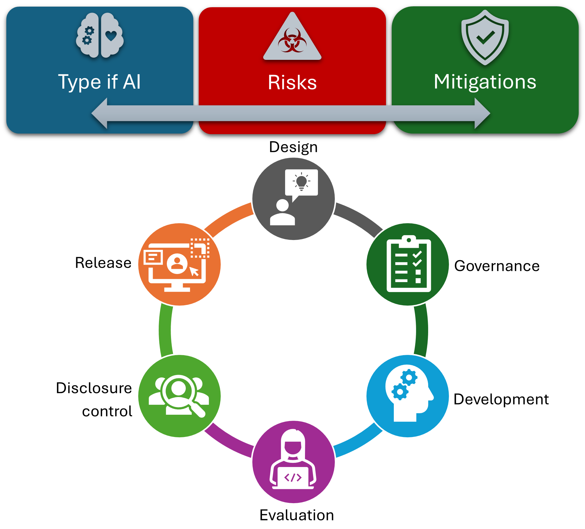

# Documentation of the types of risk and possible mitigations associated with different types of machine learning models

> ℹ️ 
>Initial Authors: Jim Smith, Alba Crespi Boixader 2025
>
> ### V0.2: May 2025

<div style="height:10px;background:black;width:400"></div>

## Introduction
<!-- ## $${\text{\color{blue}Purpose \ of\ document}}$$ -->

Trusted Research Environments (TREs) are experiencing an increased demand on project using AI and ML. There is a need to clearly identify which risks, in terms of data privacy, TREs would face depending on the type of technique the user or researcher employs. Risks can be minimised and avoided in most cases, although cannot always be completely eliminated.

*Electronic health records and other types of personal and sensitive data must be protected and ensure there is no privacy leakage when a Machine learning model is created.*

Disclosure control of Machine Learning (ML) models goes beyond of output check.Mitigation strategies should be applied throughout the life cycle of an AI/ML project in a TRE, from the design to the release. Everyone involved in the project should play a role ensuring data privacy, from project leads to researchers and TRE staff. Projects specifically designed with data privacy in mind, are much more likely to be successful, and more cost and time efficient too.

Previous work on GRAIMatter project[1], SACRO[2] and SDC-Reboot Community Interest Group showed the need for a simple and clear guidance to identify risks associated with ML projects, and the corresponding mitigation strategies.

### Purpose

This document aims to capture the types of privacy risk and mitigations associated with different forms of Machine Learning.  It is a counter-part to the [statbarns taxonomy][https://doi.org/10.1007%2F978-3-031-69651-0_19][3] for 'traditional analytic outputs from TREs. That consolidated 20+ years of theory by grouping analyses into types such as ‘frequencies, distribution shapes measures etc. With associated sets of risk and mitigations.

The objective is to produce a taxonomy of risks with their corresponding mitigation strategies. When a TRE is faced with a new ML project proposal, where the model will be egressed, there are a small number of options to consider. TREs should have in place risks assessments and mitigations flows accordingly.

*Each type of ML has a set of risks associated. The right mitigation strategies can be applied at the appropriate stage of the life cycle of a project.*

### How to navigate and use this document

Machine learning models are classified according to the outputs produced. When thinking to use it to evaluate an ML project, researchers need to provide sufficient detail of how the ML model is created for TRE staff to understand which category to look into. Therefore the right set of mitigation strategies can be applied where and when needed.

> [!IMPORTANT]
> Note that when there is no egress of the model from the TRE, there is no risk of privacy leakage from the model. Therefore this guide does not apply.

According to our classification, you need to decide which case applies to the specific project to be evaluated. For each type of models, there are examples of specific algorithms that can produce them. After a brief description, the risks are listed followed by another subsection of mitigation strategies for each risk identified.

At the end of this document there is a table summary which can be useful to get an overall idea. However, the table in isolation might be out of context. So it is recommended to always read the relevant text before taking any decision.

## Categorisation


To evaluate privacy risks, ML models are classified according to the architecture of the models produced. The first category are all those methods which data is required to be stored as part of the model to make predictions, and the second one are the ones which no not contain embedded data. This include Instance-based (some refers to them as *lazy learners*) and Foundation Models also known as *encoder-decoder* architecture models. While the first subgroup explicitly include data, Foundation models contain pre-processed data, and are typically designed so that they can subsequently be rapidly repurposed for a range of related classification or regression tasks.

In the second category, where models do not embed data, techniques are grouped depending on privacy risk they pose at the output check time. So it is about the type of output produced. Specifically the key question is whether models are designed to predict:

- numerical values (*regression models*)
- class probabilities (*classification*)
- semi-structured outputs (e.g. segmented images)
- unstructured outputs (e.g free text responses)

> [!NOTE]
> It is important to note that almost all Machine Learning Algorithms can be trained to create classification or regression models.

> [!NOTE]
>Deep Learning models are typically needed for models that produce semi-structured, unstructured outputs as well as models which are based on pre-processed embedding input data.  

<!--<div style="height:10px;background:black;width:400"></div>-->

<!-- ## $${\text{\color{blue}Types\ of\ risk\ considered}}$$ -->
### Types of risk considered

- Model *explicitly* encodes data:\
  Some models work on the basis on having as part of the model a carefully selected amount of records included to be able to make predictions. In fact this is how the so called "Lazy learners" or "instance-based" models work.\
  Other type of larger models like deep learning, it is possible to retrieve information about the training data under certain circumstances.\
  Foundation models are pre-trained in vast amounts of data, which is embedded, and posteriorly are retrained for specific purposes.
- Small-group reporting ( which can enable Re-identification / Attribute Inference):\
  *brief description*
- Class Disclosure:\
  It occurs when information of a distinct population group is reveled, often inadvertently. For instance, when either none or all of the observations in a given category come from that subpopulation.
- Privacy or Reconstruction attacks:\
  Recreate one or more record from the data used to train the ML model, either partially or fully.
  - Membership Inference (MI):\
    The objective of this type of attack is to determine whether a specific record or data belonging to a person was part of the dataset used to train the machine learning.
  - Attribute Inference for known members:\
    For this type of attack, some information of a record belonging to a person is known and consists of finding out the rest of items of the record. Some information belonging to some people, e.g. famous, can be publicly available.
  - Model Inversion:\
    The goal is to recover a subset or group of records that have something in common (belong a specific sub-class), that is disclosing records belonging to several people at a time. For example, all the people who suffer from a distinct rare disease used in the training data.


> [!NOTE]
> The input data is the data after pre-processing that is used to train the model. It is not necessarily the raw data provided by the TRE to the user or researcher.

  #### NEED TO THINK IF EXPAND RISKS INCLUDED

  - *Property Inference:*\
    *Ability to extract properties about the training data that not directly included in the ML model, and that the model unintentionally learned. For example, a NN performing gender classification but can be used to find out people who wears glasses.*
  - Linkage attack\
  - Intersection attacks\
  - Evasion attacks\
  - Poisoning attacks\
- Model can be triggered to regurgitate *implicitly* stored training data\
  *brief description*

<div style="height:10px;background:black;width:400"></div>

## Category A: contain stored data

This category are models that considered to privacy leakage extreme or very high risk. The model produces explicitly includes data. Any TRE should consider carefully this type of models. If supported, extensive details of pre-processing of the input data and/or the processed dataset will be required for evaluation of privacy risks.

> [!TIP]
> Check the model file size. Models that contain data are often large or very large.

> [!IMPORTANT]
> In general, do not perform adversarial attacks on these type of model such as membership inference or attribute inference. The danger is in the stored data, therefore subject can be identified directly. Adversarial attacks do not provide any extra information for disclosure control.

<!--## $${\text{\color{blue}Group\ 1:\ Lazy Learners or Instance-Based\ Models.}}$$-->
### Group A.1. Instance-based or lazy learners

This type of algorithms are simple and easy to implement and still widely adopted. They classify or make predictions based on proximity to a group data points known as nearest neighbors (NN). The so called NN are data points are explicitly store or embedded within the model during the training phase. They are essential for them to work.

The best knowm example is 1-Nearest Neighbour which effectively says *"What's the closest thing I've seen already?"*

#### Examples of Instance-Based Models

- Support Vector Machines (SVMs) for example Support Vector Classifiers and Support Vector Regressors.
- Radial Basis Function Networks.
- k-Nearest Neighbours (KNN).
- Case-based reasoning.
- kernel models- alternative name given to a broad class which includes SVMs.
- Self Organising Map (SOM).
- Learning Vector Quantization (LVQ).
- Locally Weighted Learning (LWL).
  
#### Principle Risk: Model explicitly contains training data

The risk from this group of models occurs because they directly embed members of the training data in the model.

> [!CAUTION]
> This  risk applies **regardless** of the type of output.

#### Mitigation

The mitigation that **must** be applied is that the preprocessing sufficiently removes any personal identifiers.

- It could be argued this effectively means that the TRE would be comfortable with releasing the pre-processed data.
- For example, the data might be transformed into a synthetic dataset via a 'Differentially' Private' embedding.

> [!WARNING]
> This mitigation does not necessarily guard against other risks, such as class disclosure.

#### Secondary Risks

All  risks below apply and should also be checked for - although the primary mitigation *may* be sufficient for these also.

- Small Group Reporting
- Class Disclosure
- Attribute Inference
  
<!--<div style="height:10px;background:black;width:400"></div>-->

<!--## $${\text{\color{blue}Group6:\ Foundation\ models}}$$-->
### Group A.2. Foundation Models

These type of models are pre-trained on vast amounts of general data from a given domain (often unlabelled, almost always sequence-structured), and then are fine-tuned, adapted or carefully engineered for specific applications. They are adaptable and proving, in many cases, more efficient than a single model for the use-case. With only a few foundation models, trained on a very limited number of datasets, the applications are vast. However, it poses a monopolistic power structure problem.

The goal is learn a useful 'embedding' (effectively a preprocessing that maps high-dimensional data onto  to a smaller set of features) that captures all of the important information within a sequence. This storing forms the bridge between the *encoder* (learned preprocessing) and the *decoder* which transforms the encoded inputs back into a form suitable for a task.

They are based on deep neural networks and transfer learning. Which are well stablish method in the AI world. The main difference lie on being trained on extreme large amounts of data. Therefore the ability to be transferred across domains.

#### Examples

Some examples of foundational models are:

- Large Language Models:
  - Open AI's GPT-Series
  - OpenLLaMa
  - BERT
- Vision models:
  - CLIP
  
The application specific fine-tuned models are mostly in the field of natural language processing (NLP), and well known examples include:

- ChatGPT
- DeepSeek
- Gemini
- Grok
- DALL-E

#### Considerations at project inception

Typically foundation models are 'pre-trained' using a decoder that attempts to solve a task that does not require manually labelled data, and so can use huge datasets from the internet e.g.:

- predict the next token in a sequence for *large language models* (Chat-GPT etc.)
- removing randomly added 'noise' from an image   for *vision-based transformers* (Dall-E etc.)

Subsequently they can be retrained for a specific tasks using smaller amounts of unlabelled data. Often this is done by only removing the 'head" (the final layer(s) of the *decoder*)  and replacing it with one suited to the new task (e.g. *N* output nodes for a classification problem with *N* different labels)

When a project wants to use a foundation model it is vital from project inception to  be clear whether researchers want to:

- Scenario 1. Import a pre-trained model, then put a new 'head' on it and train that for a new project **without affecting the rest of the foundation model**.
  - In this case they may not even need to export most of the model- just the prediction head. Therefore the 'head' can be treated as a simple [regression](#group-b1-regression-models) or [classification](#group-b2-classification-models) model.
  - It would be reasonable to ask the researcher to separate their code into callable functions that do preprocessing (i.e. the unchanged 'body' of the foundation model) and prediction ('head'). This would allow  the TRE can run the various mitigation tests described above.
  - If the head is simply a single output layer, then this is effectively  a linear or logistic regression model and can be evaluated as such.
- Scenario 2. Import a pre-trained model, put a new head on it, then adapt the head **and the 'body' of foundation model weights**.
  - In this case potentially both the head and the body could be memorising trainign data and so need assessing
- Scenario 3. Train a foundation model from scratch and then export it.

### Risks and mitigations

Often, it is unclear the data which the foundation model had been pre-trained on. Including, dataset bias, copyright and license. TREs must ensure it can be hosted. Note that, as they are based on deep neural networks is highly likely it may contain data inside the pre-trained model.

In both these last two cases the full model needs to be evaluated for risks including:

- Risk 1. Model *explicitly* encodes data
- Risk 2. Small-group reporting (which can enable Re-identification / Attribute Inference)
- Risk 3. Class Disclosure
- Risk 4. Attribute Inference for known members.
- Risk 5. Membership Inference.

The first four risks  can be usually be measured without retraining the model, which may be plausible.

However, current tests to assess the risk of Membership Inference involve training several 'shadow' models of the same complexity, with slightly different datasets.
Whether this is plausible will depend entirely on the run-time it took to train the resarcher's model:

- it  **may** be possible for scenario 2, depending on the size of the training data and however many `epochs' (iterations) of training were used.
- is **highly unlikely** to be feasible for scenario 3 (training a foundation model from scratch).

<!--<div style="height:10px;background:black;width:400"></div>-->

## Category B: Eager learners

This category are lower privacy risk type of ML models. Data is not stored, however, in some circumstances might leak certain specific groups of data.

<!--## $${\text{\color{blue}Group\ 2:\ Regression\ Models}}$$-->
### Group B.1. Regression models

These are models that have been trained to make a numerical prediction - in which we do not include probability of some event or class occurring.  
Examples from different domains include: air pollutant levels, risk of re-offending, duration of hospital stay, etc.

In general the risks for this group are the same as for well understood Linear/Logistic/Logit Regression.

#### Examples of Regression Models

Regression models can be created with most Machine Learning Algorithms, as well as many different statistical techniques such as the *ARIMA* family of models.

#### Principal risk: *Small Group Reporting*

- the model should not be specified so completely that  any part of it describes a small group of records
- typically this means stipulating a lower limit on the *residual degrees of freedom* :  
  ```DoF =  number_of_records - number_of_trainable_parameters_in_the_model```

Some models may implicitly or explicitly perform *piece-wise regression* in  which case each sub-group should be checked for size.

- i.e., are there some output values which are only predicted for a small number of training records

#### Secondary risks

- Class disclosure
  - but this probably only occurs when a models is trained to predict levels of more 2 or more variables.

#### Mitigations for Regression Models

1. Models pass  'Structural Attacks'

- for classification models these  check for residual degrees of freedom, class disclosure and k-anonymity
- a  small amount of work is needed  to adapt to regression models.
- prioritisaion to be decided by the community
- These are relatively cheap to run as they do not involve training any new models.

2. Model Query Controls

- might be appropriate for extremely large regression models with multiple predicted variables

<1--<div style="height:10px;background:black;width:400"></div>==>

<!--## $${\text{\color{blue}Group\ 3:\ Classification\ Models}}$$-->
### Group B.2. Classification Models.

These models  are designed to predict the probability that a record is associated with different output classes.
This could be a single value *P(voting in next election)* or the likelihoods associated with a finite set of classes e.g. *P(votes for party X)* or linking genetic/health records to different disease diagnoses.

#### Examples of Classification Models

Classification models can be created with most Machine Learning Algorithms

#### Risks  and Mitigations

1. Small-group reporting ( which can enable Re-identification / Attribute Inference)
2. Class Disclosure
3. Membership Inference
4. Attribute Inference for known members
5. Model Inversion

<!--<div style="height:10px;background:black;width:400"></div>-->

<!--## $${\text{\color{blue}Group\ 4:\ Models\ producing\ semi-structured\ outputs}}$$-->
### Group B.3. Models producing semi-structured outputs

*brief description to follow*

#### Examples

- Vision-based  models that automatically segment "regions of interest" in an image.
  
#### Risks  and Mitigations

1. Small-group reporting ( which can enable Re-identification / Attribute Inference)
2. Class Disclosure
3. Membership Inference
4. Attribute Inference for known members
5. Model Inversion

<!--<div style="height:10px;background:black;width:400"></div>-->

<!--## $${\text{\color{blue}Group5:\ Models\ producing\ unstructured\ outputs (e.g.\ Natural\ Language).}}$$-->
### Group B.4. Models producing unstructured outputs

*brief description to follow*

#### Examples

- Models that  produce summaries of inputs (could be text or images)
- Chatbots
- **Foresight**
-

#### Risks  and Mitigations

1. Model can be triggered to regurgitate implictly stored training data
2. Small-group reporting ( which can enable Re-identification / Attribute Inference)
3. Class Disclosure
4. Membership Inference
5. Attribute Inference for known members
6. Model Inversion

Mitigation 1:  *alignment* via human-in-the-loop-reinforcement-learning,

- used for commercial Large Language Models to try and prevent them giving certain responses
- but recent reports suggest that [these defences can be broken](https://www.theguardian.com/technology/2024/apr/03/many-shot-jailbreaking-ai-artificial-intelligence-safety-features-bypass?CMP=Share_iOSApp_Other)

<div style="height:10px;background:black;width:400"></div>

Note: Groups 4 and 5 are both forms of generative AI

#### References

Schneider, J., Meske, C. & Kuss, P. Foundation Models. Bus Inf Syst Eng 66, 221–231 (2024). <https://doi.org/10.1007/s12599-024-00851-0>

<https://dl.acm.org/doi/full/10.1145/3624010>

### $${\text{\color{blue}Summary table}}$$

#### Risks

|Model type    | Encoded data | Small group reporting | Class disclosure | Membership Inference | Attribute Inference | Property inference | Linkage attack | Computational cost|
|---|---|---|---|---|---|---|---|--|
|Lazy learners|🔴🟥❌|🔴🟥✔|🔴|🔴|🔴|🔴|🔴|&#x2191;|
|Regression models|🟢|🔴|🟡|🔴|🔴|🔴|🔴|&#x2191;&#x2191;|
|Classification|🟢|🔴|🔴|🔴|🔴|🔴|🔴|&#x2191;&#x2191;|
|Models producing semi-structured outputs|🟢|🔴|🔴|🔴|🟡|🔴|🔴|&#x2191;&#x2191;&#x2191;|
|Models producing unstructured outputs|🟡|🔴|🔴|🔴|🔴|🔴|🔴|&#x2191;&#x2191;&#x2191;|
|Foundation models|🔴🔺🟥|🔴|🔴|🔴|🔴|🔴|🔴|&#x2191;&#x2191;&#x2191;&#x2191;&#x2191;&#x2191;&#x2191;|

Legend:
Event likelihood
🟢 Low or very low
🟡 Medium
🔴 High

Severity/Consequences/Impact
🟩 Low
🟨 Medium
🟥 Catastrophic

Mitigation measures
❌ Not possible
✔  Possible

❓Unknown

Risk classification:

- How likely is the event/specific type of risk to happen.
- The impact it has. For example, for disclosure control could be something such as exposing 1 or 2 records versus exposing all/almost all records.
- How easy would it be to apply a successful mitigation strategy? - sometimes it might be possible, but it might impact the output negatively. So it has the be a balance between technically possible and achievable in practice?

#### Mitigations

The following table has a list of mitigations measures and to which risk they can protect against.

|Mitigation    | Encoded data | Small group reporting | Class disclosure | Membership Inference | Attribute Inference | Model Inversion | Linkage attack |
|---|---|---|---|---|---|---|---|
|Differentially private methods||||||||
|Use synthetic data instead||||||||
|Dataset anonymisation||||||||
|Data grouping||||||||
|Predictions return minimal information (e.g. Yes/No)||||||||
|||||||||
|||||||||
|||||||||
|||||||||

#### References

[1] Learning (ML) models from Trusted Research Environments (TREs),” Zenodo, 2022.

[2] P. W. J.E. Smith, M. Albashir, S. Bacon, B. Butler-Cole, J. Caldwell, C. Cole, A. Crespi Boixader, E. Green, E. Jefferson, Y. Jones, S. Krueger, J. Liley, A. McNeill, K. O’Sullivan, K. Oldfield, R. Preen, F. Ritchie, L. Robinson, S. Rogers, P. Stokes, A. Tilbr, “Semi-Automated Checking of Research Outputs (SACRO),” Zenodo, 2023.

[3] E. Green, F. Ritche, and P. White, “The statbarn: A New Model for Output Statistical Disclosure Control,” in Privacy in Statistical Databases, 2024, pp. 284–293.
