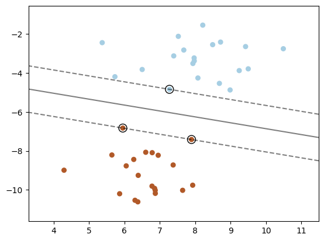
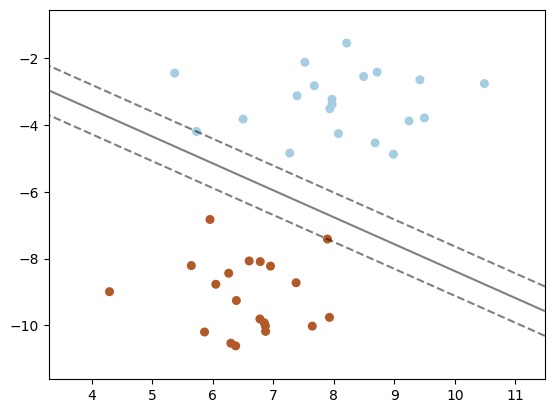
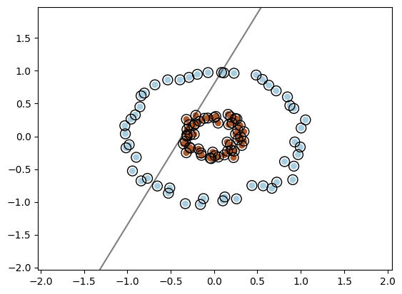
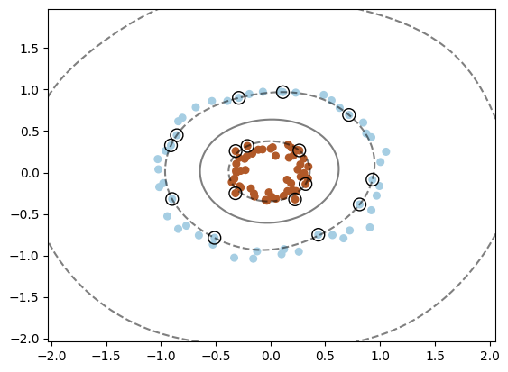

# Privacy issues associated with support vector machines

Support vector machine (SVM) classifiers are a type of model that define the descision boundary between classes as a hyperplane. This hyperplane is defined by the closest observations, otherwise known as the support vectors.

## Summary

There are two main types of SVM classifier models: linear, and kernel-based. There are different privacy implications associated with each when training models with sensitive data.

1. Linear SVMs
   - Used when classes are linearly separable.
   - Predictions can be computed using only the equation of the decision boundary hyperplane.
   - Some implementations store the support vectors, and some don't.
   - If the support vectors are stored, extract only the coefficients and intercept, and use only those. See example below.
2. Kernel-based SVMs
   - Used when the classes are not linearly separable.
   - Kernels, such as polynomial or RBF kernels, are used to efficiently project the input features into a higher dimensional space.
   - When they are transformed into the higher dimensional space, the features become separable and can be classified based on the hyperplane in the same way as a linear SVM
   - The kernels are a function of the support vectors, so the predictions cannot be computed without exposing the support vectors.


In the case that kernel-based SVMs are used, or linear SVMs are used without removing the support vectors, then the release of the a model should be treated as though the sensitive data corresponding to the support vectors is being released directly - the support vectors are explicitly encoded into the model. Other than the data for the support vectors (including the choice of such data), there is no information about the other data in the training set, only the support vectors and their coefficients are relevant.

In the case that a linear SVM is used with a model that does not store the support vectors, other less direct risks may still apply, particularly if the model has been overfitted.

These points are illustrated in the following examples.

## 2-dimensional linearly separable example

Scikit-Learn uses the [following example](https://scikit-learn.org/stable/auto_examples/svm/plot_separating_hyperplane.html#sphx-glr-auto-examples-svm-plot-separating-hyperplane-py) to show what an SVM classifier does.


```python
#Imports
import matplotlib.pyplot as plt
import numpy as np

from sklearn import svm
from sklearn.datasets import make_blobs, make_circles
from sklearn.inspection import DecisionBoundaryDisplay
```

In this example problem, we define 2 blobs to represent two classes that we want the model to be able to separate.


```python
# we create 40 separable points
X, y = make_blobs(n_samples=40, centers=2, random_state=6)

# The classes, y, are ones and zeros. Traditionally SVMs use one and minus one so we can convert them:
y = 2 * y -1

print("Training features: {}".format(X))
print("Training targets: {}".format(y))
```

    Training features: [[  6.37734541 -10.61510727]
     [  6.50072722  -3.82403586]
     [  4.29225906  -8.99220442]
     [  7.39169472  -3.1266933 ]
     [  7.64306311 -10.02356892]
     [  8.68185687  -4.53683537]
     [  5.37042238  -2.44715237]
     [  9.24223825  -3.88003098]
     [  5.73005848  -4.19481136]
     [  7.9683312   -3.23125265]
     [  7.37578372  -8.7241701 ]
     [  6.95292352  -8.22624269]
     [  8.21201164  -1.54781358]
     [  6.85086785  -9.92422452]
     [  5.64443032  -8.21045789]
     [ 10.48848359  -2.75858164]
     [  7.27059007  -4.84225716]
     [  6.29784608 -10.53468031]
     [  9.42169269  -2.6476988 ]
     [  8.98426675  -4.87449712]
     [  6.6008728   -8.07144707]
     [  5.95313618  -6.82945967]
     [  6.87151089 -10.18071547]
     [  6.26221548  -8.43925752]
     [  7.97164446  -3.38236058]
     [  7.67619643  -2.82620437]
     [  7.92736799  -9.7615272 ]
     [  5.86311158 -10.19958738]
     [  8.07502382  -4.25949569]
     [  6.78335342  -8.09238614]
     [  7.89359985  -7.41655113]
     [  6.04907774  -8.76969991]
     [  6.77811308  -9.80940478]
     [  8.71445065  -2.41730491]
     [  8.49142837  -2.54974889]
     [  9.49649411  -3.7902975 ]
     [  7.52132141  -2.12266605]
     [  6.3883927   -9.25691447]
     [  7.93333064  -3.51553205]
     [  6.86866543 -10.02289012]]
    Training targets: [ 1 -1  1 -1  1 -1 -1 -1 -1 -1  1  1 -1  1  1 -1 -1  1 -1 -1  1  1  1  1
     -1 -1  1  1 -1  1  1  1  1 -1 -1 -1 -1  1 -1  1]
    

In this case, the hyperplane can be defined as a straight line separating the two blobs. Using the linear option in the scikit-learn SVC class, we train a model, and plot that line, and the closest points to the line: the support vectors.


```python
# initialise the model, don't regularize for illustration purposes
linear_svm_classifier = svm.SVC(kernel="linear", C=1000)
linear_svm_classifier.fit(X, y)

plt.scatter(X[:, 0], X[:, 1], c=y, s=30, cmap=plt.cm.Paired)

# plot the decision function
ax = plt.gca()
DecisionBoundaryDisplay.from_estimator(linear_svm_classifier, X, plot_method="contour", colors="k", levels=[-1, 0, 1], alpha=0.5, linestyles=["--", "-", "--"], ax=ax,)

# plot support vectors
ax.scatter(linear_svm_classifier.support_vectors_[:, 0], linear_svm_classifier.support_vectors_[:, 1], s=100, linewidth=1, facecolors="none", edgecolors="k",)
plt.show()
```


    

    


Once that model has been trained, it can be used to classify new data points.


```python
new_data_points = np.array([[9.0, -4.5], [5.0,  -2.0], [9.0,  -8.0]])
for dpx, dpy in zip(new_data_points, linear_svm_classifier.predict(new_data_points)):
    print("New data point: ({}, {}), predicted class: {}".format(dpx[0], dpx[1], dpy))
```

    New data point: (9.0, -4.5), predicted class: -1
    New data point: (5.0, -2.0), predicted class: -1
    New data point: (9.0, -8.0), predicted class: 1
    

But what if this model was trained on sensitive data and released for outsiders to use as it currently is? Because the support vectors are saved on the model, anyone who has access to this model has access to that data.


```python
print("Coefficients: {}".format(linear_svm_classifier.coef_[0]))
print("Intercept: {}".format(linear_svm_classifier.intercept_[0]))
print("Support vectors: {}".format(linear_svm_classifier.support_vectors_))
```

    Coefficients: [-0.2539717  -0.83806387]
    Intercept: -3.211328260154484
    Support vectors: [[ 7.27059007 -4.84225716]
     [ 5.95313618 -6.82945967]
     [ 7.89359985 -7.41655113]]
    

However, because the model is linear, all that is needed to classify new datapoints are the coefficient and intercept of the decision boundary line. We could easily make our own classifier that does not contain any of the original datapoints, and avoid releasing the support vectors.


```python
class MinimalSVMLinearClassifier:
    def __init__(self, coefficients, intercept):
        self.coefficients = coefficients
        self.intercept = intercept
    def predict(self, X):
        return np.sign(np.dot(X, self.coefficients) + self.intercept)

minimal_linear_svm_classifier = MinimalSVMLinearClassifier(linear_svm_classifier.coef_[0], linear_svm_classifier.intercept_[0])
for dpx, dpy in zip(new_data_points, minimal_linear_svm_classifier.predict(new_data_points)):
    print("Data point: ({}, {}), predicted class: {}".format(dpx[0], dpx[1], dpy))
```

    Data point: (9.0, -4.5), predicted class: -1.0
    Data point: (5.0, -2.0), predicted class: -1.0
    Data point: (9.0, -8.0), predicted class: 1.0
    

Alternatively, the Scikit-Learn model LinearSVC has a similar interface, but a different underlying implementation, that [does not expose the support vectors](https://scikit-learn.org/stable/auto_examples/svm/plot_linearsvc_support_vectors.html). Here is the same example trained using LinearSVC.


```python
linear_svc = svm.LinearSVC(C=1000)
linear_svc.fit(X, y)

plt.scatter(X[:, 0], X[:, 1], c=y, s=30, cmap=plt.cm.Paired)

# plot the decision function
ax = plt.gca()
DecisionBoundaryDisplay.from_estimator(linear_svc, X, plot_method="contour", colors="k", levels=[-1, 0, 1], alpha=0.5, linestyles=["--", "-", "--"],ax=ax,)

plt.show()
```


    

    


The resulting model is slightly different from the SVC example on the same data, because of a different underlying implementation. In this case, the coefficients and intercept are stored, but not the support vectors.


```python
print("Coefficients: {}".format(linear_svc.coef_[0]))
print("Intercept: {}".format(linear_svc.intercept_[0]))
print("Support vectors: {}".format(linear_svc.support_vectors_))
```

    Coefficients: [-1.0909523 -1.352918 ]
    Intercept: -0.42306804464835607
    


    ---------------------------------------------------------------------------

    AttributeError                            Traceback (most recent call last)

    Cell In[9], line 3
          1 print("Coefficients: {}".format(linear_svc.coef_[0]))
          2 print("Intercept: {}".format(linear_svc.intercept_[0]))
    ----> 3 print("Support vectors: {}".format(linear_svc.support_vectors_))
    

    AttributeError: 'LinearSVC' object has no attribute 'support_vectors_'


## 2-dimension non-linearly seperable example

Linear SVMs do not perform well when the data is not linearly seperable. This is an example using circles instead of blobs.


```python
X, y = make_circles(n_samples=100, random_state=6, noise=0.05, factor=0.3)
# convert 0s to -1s
y = 2 * y -1
```


```python
# initialise the model
circles_linear_svm_classifier = svm.SVC(kernel="linear")
circles_linear_svm_classifier.fit(X, y)

plt.scatter(X[:, 0], X[:, 1], c=y, s=30, cmap=plt.cm.Paired)

# plot the decision function
ax = plt.gca()
DecisionBoundaryDisplay.from_estimator(circles_linear_svm_classifier, X, plot_method="contour", colors="k", levels=[-1, 0, 1], alpha=0.5, linestyles=["--", "-", "--"], ax=ax,)

# plot support vectors
ax.scatter(circles_linear_svm_classifier.support_vectors_[:, 0], circles_linear_svm_classifier.support_vectors_[:, 1], s=100, linewidth=1, facecolors="none", edgecolors="k",)
plt.show()
```


    

    


Using the RBF kernel creates a circular descision boundary that can sucessfully seperate the classes. What values defines this descision boundary?

This is not going to be a useful classifier for this problem. Using the RBF kernel version of the SVC model will work much better.


```python
# initialise the model
circles_rbf_svm_classifier = svm.SVC(kernel="rbf")
circles_rbf_svm_classifier.fit(X, y)

plt.scatter(X[:, 0], X[:, 1], c=y, s=30, cmap=plt.cm.Paired)

# plot the decision function
ax = plt.gca()
DecisionBoundaryDisplay.from_estimator(circles_rbf_svm_classifier, X, plot_method="contour", colors="k", levels=[-1, 0, 1], alpha=0.5, linestyles=["--", "-", "--"], ax=ax,)

# plot support vectors
ax.scatter(circles_rbf_svm_classifier.support_vectors_[:, 0], circles_rbf_svm_classifier.support_vectors_[:, 1], s=100, linewidth=1, facecolors="none", edgecolors="k",)
plt.show()
```


    

    


```python
print("Support vectors: {}".format(circles_rbf_svm_classifier.support_vectors_))
print("Intercept: {}".format(circles_rbf_svm_classifier.intercept_[0]))
print("Coefficients: {}".format(circles_rbf_svm_classifier.coef_[0]))
```

    Support vectors: [[-0.51061872 -0.78757682]
     [ 0.93051878 -0.08602509]
     [ 0.81328803 -0.38522144]
     [ 0.4366286  -0.7503031 ]
     [-0.90753858  0.32748365]
     [ 0.1130369   0.96877233]
     [-0.85451495  0.4501141 ]
     [ 0.71643069  0.69397787]
     [-0.89706072 -0.31953815]
     [-0.28879696  0.89963417]
     [-0.21000704  0.32036454]
     [ 0.32052457 -0.13915019]
     [ 0.22439748 -0.32435827]
     [ 0.26337564  0.26634059]
     [-0.31793578  0.25908482]
     [-0.3196036  -0.25001388]]
    Intercept: -0.9602813250177151
    


    ---------------------------------------------------------------------------

    AttributeError                            Traceback (most recent call last)

    Cell In[16], line 3
          1 print("Support vectors: {}".format(circles_rbf_svm_classifier.support_vectors_))
          2 print("Intercept: {}".format(circles_rbf_svm_classifier.intercept_[0]))
    ----> 3 print("Coefficients: {}".format(circles_rbf_svm_classifier.coef_[0]))
    

    File ~\AppData\Local\Programs\Python\Python312\Lib\site-packages\sklearn\svm\_base.py:660, in BaseLibSVM.coef_(self)
        653 """Weights assigned to the features when `kernel="linear"`.
        654 
        655 Returns
        656 -------
        657 ndarray of shape (n_features, n_classes)
        658 """
        659 if self.kernel != "linear":
    --> 660     raise AttributeError("coef_ is only available when using a linear kernel")
        662 coef = self._get_coef()
        664 # coef_ being a read-only property, it's better to mark the value as
        665 # immutable to avoid hiding potential bugs for the unsuspecting user.
    

    AttributeError: coef_ is only available when using a linear kernel


Like the linear example using the SVC class, the support vectors are exposed in the model. However, as there is no straight line, there is no way to create a predictor just using the coefficients and intercept. The RBF Kernel version of SVC (or any other Kernel function) uses the relationship between each of the support vectors and a new point, along with the dual coefficients, to generate a prediction. Here is the descision function from [Sci-Kit Learn](https://scikit-learn.org/stable/modules/svm.html#svm-mathematical-formulation):


$\sum_{i\in SV} y_i \alpha_i K(x_i, x) + b$

where $b$ is the intercept, $\alpha_i$ is the dual coefficient, $y_i$ are the target values of the support vectors, and $K(x_i, x)$ is the kernel function applied to each of the support vectors $x_i$ and the input values $x$.

The intercept $b$ and the product $y_i \alpha_i$ are found on the model as intercept_ and dual_coef_, but calculating the Kernel function requires the support vectors. For a single support vector $i$, the RBF kernel could be calculated like this:


```python
def rbf_kernel(x, x_i, gamma):
    return np.exp(- gamma * np.sum((x - x_i) ** 2))
                                  
new_predicted_point = np.array([0, 0])
rbf_val_1 = rbf_kernel(new_predicted_point, circles_rbf_svm_classifier.support_vectors_[1], circles_rbf_svm_classifier._gamma)
print("support vector x_1: {}".format(circles_rbf_svm_classifier.support_vectors_[1]))
print("new predicted point x: {}".format(new_predicted_point))
print("RBF for support vector x_1: {}".format(rbf_val_1))
```

    support vector x_1: [ 0.93051878 -0.08602509]
    new predicted point x: [0 0]
    RBF for support vector x_1: 0.20558412099228485
    

To use this classifier to predict classes for new data, access to the support vectors - a subset of the training data - is required because the kernel is defined by the relationship between the new data point and the support vectors.


```python

```
